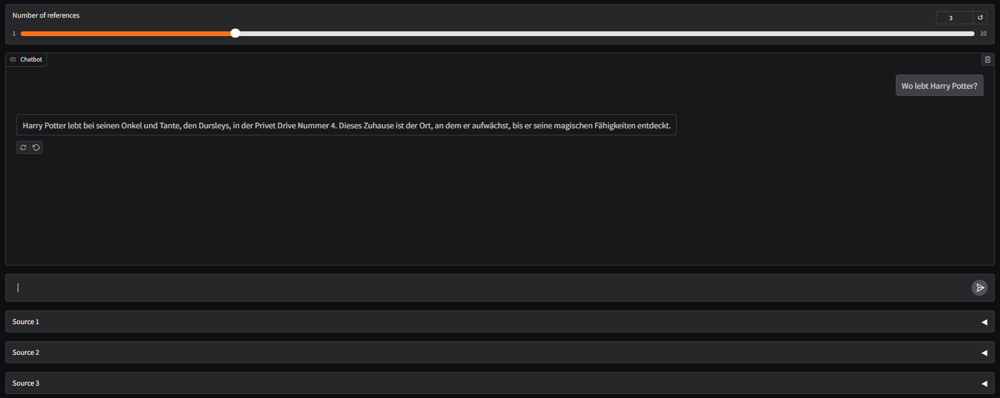

<h3 align="center">RAG Chatbot</h3>

<div align="center">

[](https://github.com/tutz/rag_chatbot/actions)
[](https://github.com/pre-commit/pre-commit)
[](https://github.com/astral-sh/ruff)
[](https://mypy-lang.org/)

</div>

---

<p align="center"> 🤖 A chatbot that uses Retrieval-Augmented Generation (RAG) to provide accurate and context-aware responses.
  <br>
</p>

## 📝 Table of Contents

- [About](#about)
- [Demo / Working](#demo)
- [How it works](#working)
- [Usage](#usage)
- [Getting Started](#getting_started)
- [Deploying your own bot](#deployment)
- [Built Using](#built_using)
- [TODO](../TODO.md)
- [Contributing](../CONTRIBUTING.md)
- [Authors](#authors)
- [Acknowledgments](#acknowledgement)

## 🧐 About <a name = "about"></a>

The RAG Chatbot is designed to leverage the power of Retrieval-Augmented Generation to provide users with accurate and contextually relevant responses. It combines the strengths of retrieval-based and generative models to enhance the user experience.

## 💭 How it works <a name = "working"></a>

The chatbot first retrieves relevant documents from a pre-defined knowledge base using a retrieval model. It then uses a generative model to generate a response based on the retrieved documents and the user's query.

The bot uses the OpenAI API for the generative model and a Chroma vectorstore for the retrieval model. The entire bot is written in Python 3.12.

## 🎈 Usage <a name = "usage"></a>

The bot has a simple UI where you can input your question and set the number of references to use. After submitting your question, the bot will provide a response based on the retrieved documents and the generative model. You will also see the PDF pages that were used to generate the response.



## 🏁 Getting Started <a name = "getting_started"></a>

These instructions will get you a copy of the project up and running on your local machine for development and testing purposes. See [deployment](#deployment) for notes on how to deploy the project on a live system.

### Prerequisites

You need to have Python and pip installed on your machine.

```
sudo apt-get install python3
sudo apt-get install python3-pip
```

### Installing

A step by step series of examples that tell you how to get a development env running.

Clone the repository:

```
git clone https://github.com/TatjanaUtz/rag_chatbot.git
cd rag_chatbot
```

Create a virtual environment and activate it:

```
python3 -m venv env
source env/bin/activate
```

Install the dependencies:

```
pip install -r requirements.txt
```

Add your PDF file(s) to the `data/raw` directory.

Run the script to create the vectorstore:

```
python src/create_vectorstore.py
```

Run the bot:

```
python src/main.py
```

The chatbot will be accessible on `http://localhost:7860`.

## 🚀 Deploying your own bot <a name = "deployment"></a>

To deploy this project on a live system using Docker and Docker Compose, follow these steps:

### Prerequisites

Ensure you have Docker and Docker Compose installed on your machine.

```
sudo apt-get install docker
sudo apt-get install docker-compose
```

### Steps

1. Clone the repository

```
git clone https://github.com/tutz/translation-service.git
cd translation-service
```

2. Build the Docker images

```
docker-compose build
```

3. Start the services

```
docker-compose up -d
```

This will start the application and its dependencies in the background.

4. Verify the services are running

```
docker-compose ps
```

You should see the translation service and its dependencies listed and running.

### Accessing the Service

The translation service will be available at `http://localhost:7860`.

To stop the services, run:

```
docker-compose down
```

This will stop and remove the containers, networks, and volumes created by Docker Compose.

## ⛏️ Built Using <a name = "built_using"></a>

- [Docker](https://www.docker.com/) - Containerization
- [pytest](https://docs.pytest.org/en/stable/) - Testing Framework
- [pre-commit](https://pre-commit.com/) - Git Hook Scripts
- [mypy](http://mypy-lang.org/) - Static Type Checker
- [Ruff](https://github.com/astral-sh/ruff) - Linter
- [OpenAI](https://www.openai.com/) - Generative Model
- [Gradio](https://gradio.app/) - User Interface

## ✍️ Authors <a name = "authors"></a>

- [@TatjanaUtz](https://github.com/TatjanaUtz) - Idea & Initial work
